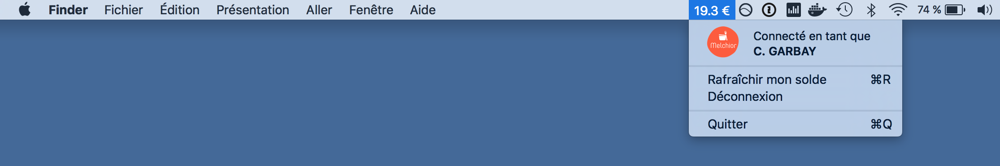

# Solde de compte 

Affiche directement le solde de ton compte dans la barre des menus de ton Mac.

Compatible avec les comptes **Melchior** ([melchior.xcard.me](http://melchior.xcard.me/)) et **Moneweb** seulement pour l'Ecole des Mines de Nantes ([sodexo-mines-nantes.moneweb.fr](https://sodexo-mines-nantes.moneweb.fr/)).
